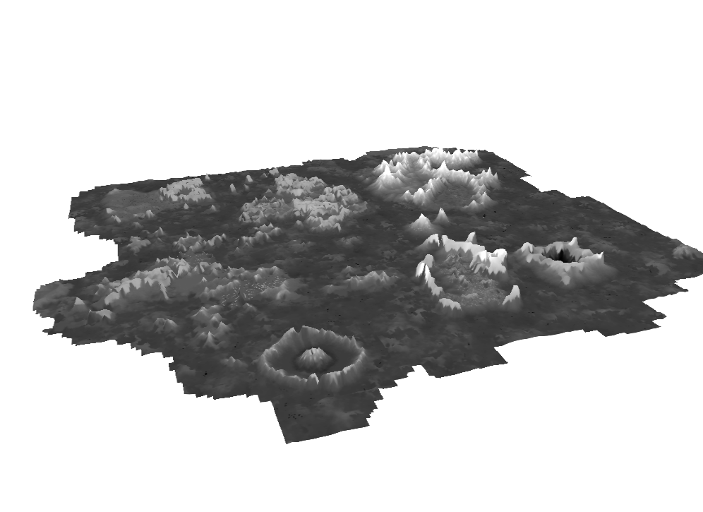
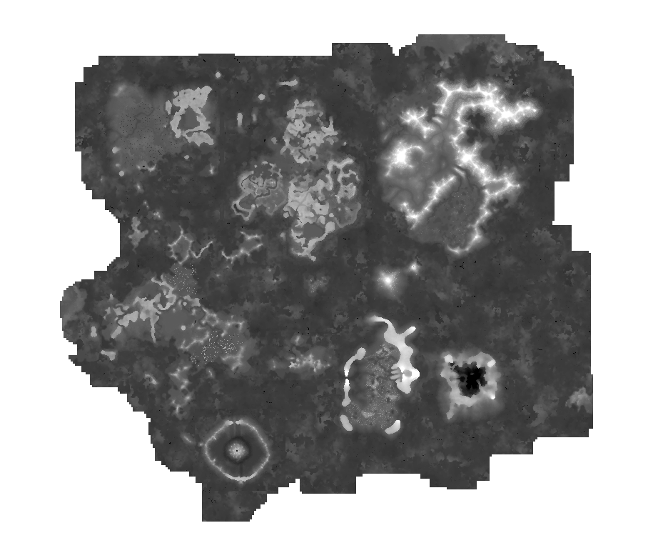
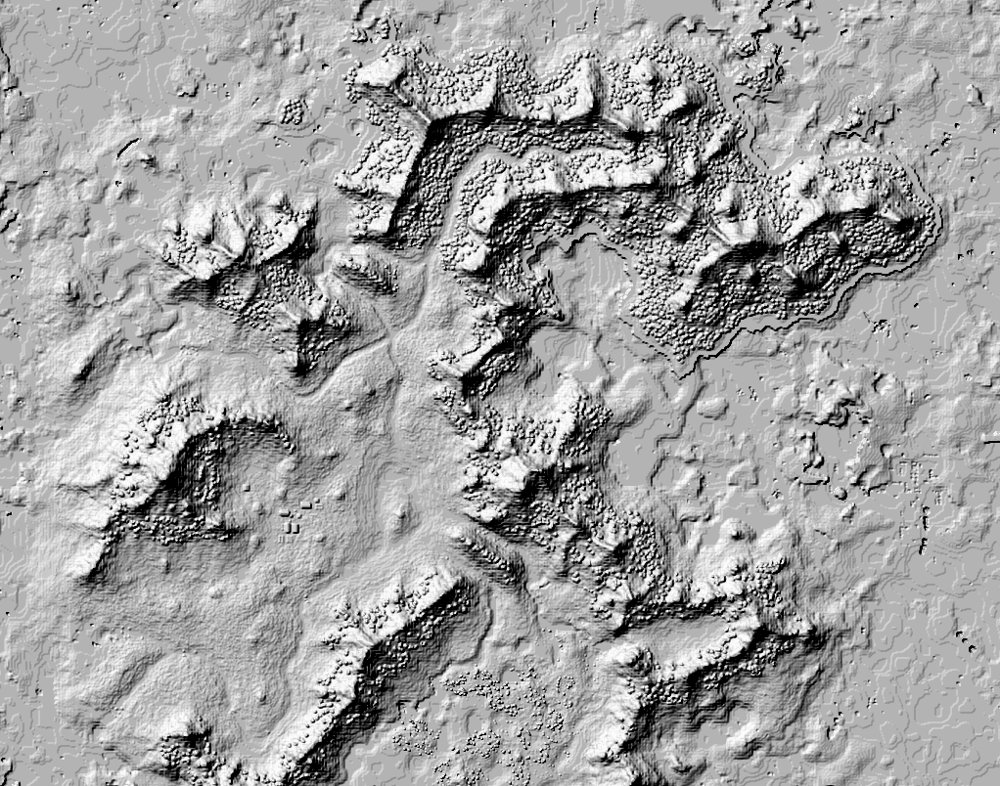

# nin-anvil
Program that generates a Digital Elevation Model (DEM) from a Minecraft Anvil world region file in the form of a georeferenced GeoTIFF.

This enables you to do make things with standard GIS software, like some examples shown below.

